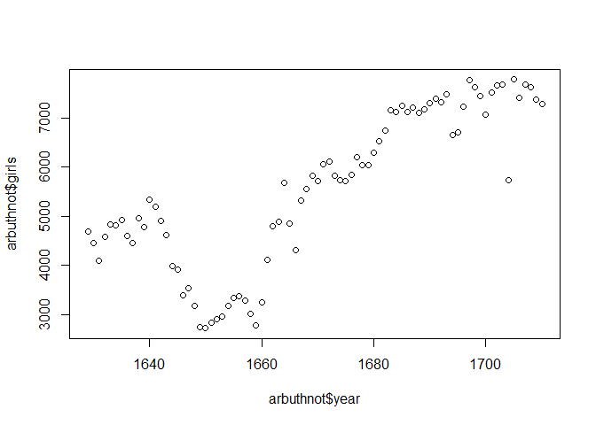
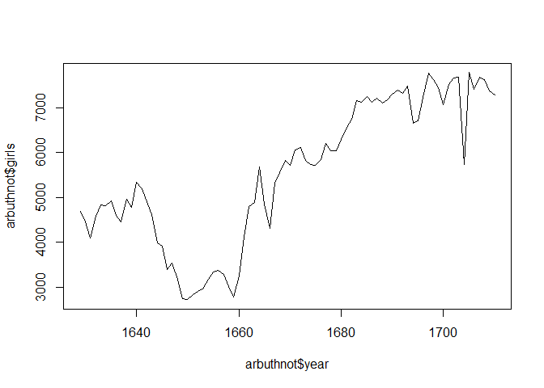
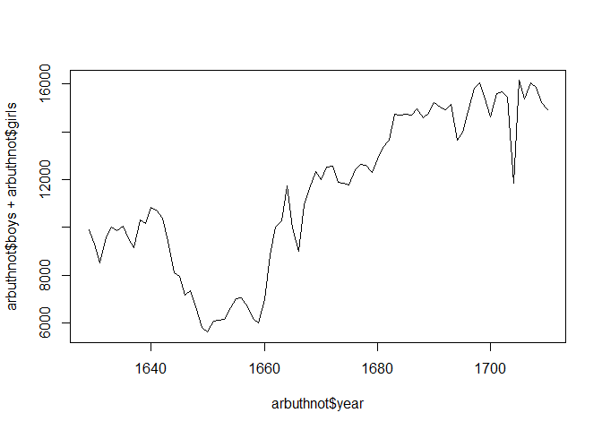
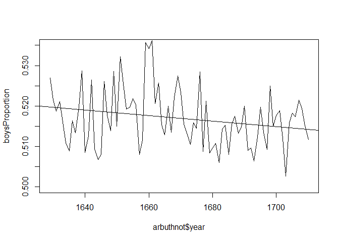
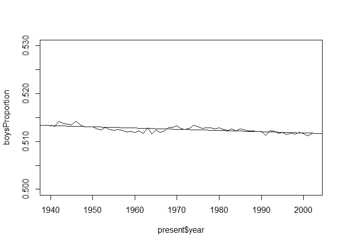
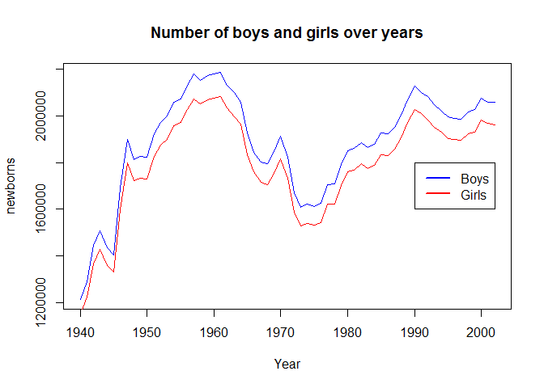

Data Analysis with R (Lab-0)
================
Pavel Andrienko
04/06/2016

url: <http://rpubs.com/pashadow/da-lab0>

The Data: Dr. Arbuthnot’s Baptism Records
-----------------------------------------

### Obtaining data

The Arbuthnot baptism counts for boys and girls

``` r
# Download dataset
source("http://www.openintro.org/stat/data/arbuthnot.R")
```

### Determining what data is

``` r
dim(arbuthnot)
```

    ## [1] 82  3

``` r
names(arbuthnot)
```

    ## [1] "year"  "boys"  "girls"

``` r
head(arbuthnot)
```

    ##   year boys girls
    ## 1 1629 5218  4683
    ## 2 1630 4858  4457
    ## 3 1631 4422  4102
    ## 4 1632 4994  4590
    ## 5 1633 5158  4839
    ## 6 1634 5035  4820

### Some Exploration

This command will only show the number of boys baptized each year.

``` r
arbuthnot$boys
```

    ##  [1] 5218 4858 4422 4994 5158 5035 5106 4917 4703 5359 5366 5518 5470 5460
    ## [15] 4793 4107 4047 3768 3796 3363 3079 2890 3231 3220 3196 3441 3655 3668
    ## [29] 3396 3157 3209 3724 4748 5216 5411 6041 5114 4678 5616 6073 6506 6278
    ## [43] 6449 6443 6073 6113 6058 6552 6423 6568 6247 6548 6822 6909 7577 7575
    ## [57] 7484 7575 7737 7487 7604 7909 7662 7602 7676 6985 7263 7632 8062 8426
    ## [71] 7911 7578 8102 8031 7765 6113 8366 7952 8379 8239 7840 7640

**Excercise 1.** What command would you use to extract just the counts of girls baptized?

``` r
# counts of girls baptized each year
arbuthnot$girls
```

    ##  [1] 4683 4457 4102 4590 4839 4820 4928 4605 4457 4952 4784 5332 5200 4910
    ## [15] 4617 3997 3919 3395 3536 3181 2746 2722 2840 2908 2959 3179 3349 3382
    ## [29] 3289 3013 2781 3247 4107 4803 4881 5681 4858 4319 5322 5560 5829 5719
    ## [43] 6061 6120 5822 5738 5717 5847 6203 6033 6041 6299 6533 6744 7158 7127
    ## [57] 7246 7119 7214 7101 7167 7302 7392 7316 7483 6647 6713 7229 7767 7626
    ## [71] 7452 7061 7514 7656 7683 5738 7779 7417 7687 7623 7380 7288

``` r
# total counts of girls baptized att all
sum(arbuthnot$girls)
```

    ## [1] 453841

We can create a scatterplot plot of the number of girls baptized per year with the command

``` r
# scatterplot
plot(x = arbuthnot$year, y = arbuthnot$girls)
```

<!-- -->

``` r
# line plot
plot(x = arbuthnot$year, y = arbuthnot$girls, type = "l")
```

<!-- -->

**Excercise 2.** Is there an apparent trend in the number of girls baptized over the years? How would you describe it?

It's easy to see that the number of girls grows from 1660 till 1700 very fast.

We can make a plot of the total number of baptisms per year with the command

``` r
plot(arbuthnot$year, arbuthnot$boys + arbuthnot$girls, type = "l")
```

<!-- -->

**Excercise 3.** Now, make a plot of the proportion of boys over time. What do you see?

``` r
# calculate proportion
boysProportion <- arbuthnot$boys / (arbuthnot$boys + arbuthnot$girls)
# make plot
plot(arbuthnot$year, boysProportion, type = "l", ylim=c(0.5, 0.535))
# add regression line
abline(lm(boysProportion ~ arbuthnot$year))
```

<!-- -->

We can see that proportion of boys decreases, but it's bigger then 0.5 so number of boys is bigger than girls.

Present day birth records in the United States (Centers for Disease Control)
----------------------------------------------------------------------------

These data come from a report by the Centers for Disease Control <http://www.cdc.gov/nchs/data/nvsr/nvsr53/nvsr53_20.pdf>

### Obtaining data

``` r
# Download dataset
source("http://www.openintro.org/stat/data/present.R")
```

### Determining what data is

**Excercise 1.** What years are included in this data set? What are the dimensions of the data frame and what are the variable or column names?

``` r
# piece of data
head(present)
```

    ##   year    boys   girls
    ## 1 1940 1211684 1148715
    ## 2 1941 1289734 1223693
    ## 3 1942 1444365 1364631
    ## 4 1943 1508959 1427901
    ## 5 1944 1435301 1359499
    ## 6 1945 1404587 1330869

``` r
# dimensins
dim(present)
```

    ## [1] 63  3

``` r
# column names
names(present)
```

    ## [1] "year"  "boys"  "girls"

### Some Exploration

**Excercise 2.** How do these counts compare to Arbuthnot’s? Are they on a similar scale?

``` r
# arbuthnot mean 
mean(arbuthnot$boys + arbuthnot$girls)
```

    ## [1] 11441.74

``` r
# present mean
mean(present$boys + present$girls)
```

    ## [1] 3679515

We can see difference is very big. Counts are on different scale.

**Excercise 3.** Make a plot that displays the boy-to-girl ratio for every year in the data set. What do you see? Does Arbuthnot’s observation about boys being born in greater proportion than girls hold up in the U.S.? Include the plot in your response.

``` r
# calculate proportion
boysProportion <- present$boys / (present$boys + present$girls)
# make plot
plot(present$year, boysProportion, type = "l", ylim=c(0.5, 0.53))
# add regression line
abline(lm(boysProportion ~ present$year))
```

<!-- -->

It's easy to see that boy-to-girl ratio is bigger then 0.5, so Arbuthnot’s observation about boys being born in greater proportion than girls holds up in the U.S.

**Excercise 4.** In what year did we see the most total number of births in the U.S.?

``` r
plot(x = present$year, y = present$boys, col="blue", type = "l",
     xlab="Year",ylab="newborns",main="Number of boys and girls over years")
lines(x = present$year, y = present$girls, col="red")
legend(1990, 1800000, c("Boys","Girls"), lty=c(1,1), lwd=c(2.5,2.5), col=c("blue","red"))
```

<!-- -->

As we can see from plot the most total number of births in the U.S. was around 1960 years.

We can calculate this more precisely

``` r
present$year[(present$boys + present$girls) == max(present$boys + present$girls)]
```

    ## [1] 1961
